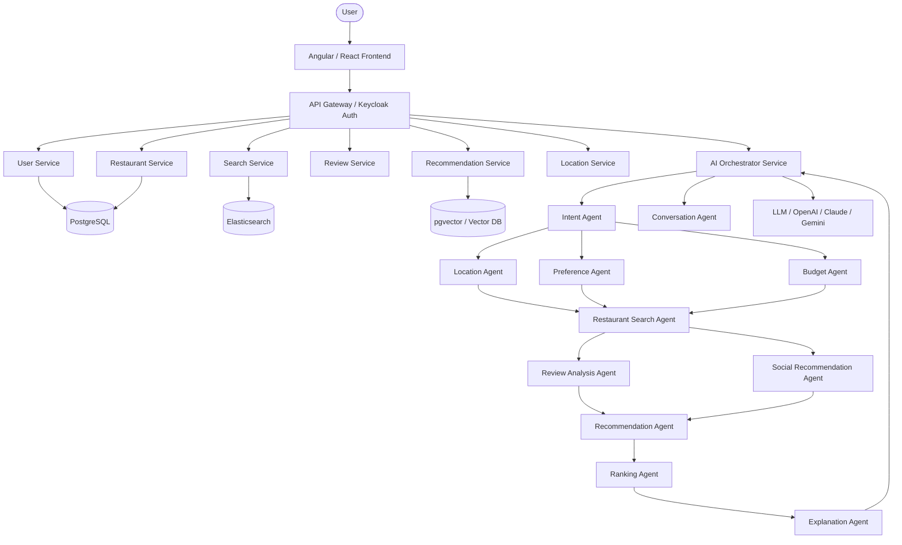

# AI-Powered Restaurant Recommendation Platform - Architecture

## 1. High-Level System Architecture

The platform follows a microservices-based architecture integrated with a multi-agent AI system. The system uses a conversational interface to gather natural language inputs from the user, parse intents, and communicate with specialized backend services to serve highly personalized restaurant recommendations.

## 2. Multi-Agent AI Architecture

The system utilizes a multi-agent orchestration approach where specialized AI agents collaborate to fulfill a user's request.

- **Conversation Agent:** Interacts with the user, handles natural-language requests, and manages the conversational state.
- **Intent Agent:** Parses user queries and converts them into structured search criteria (e.g., extracting budget, location, and cuisine).
- **Location Agent:** Calculates distances, travel times, and maps user queries to geographical coordinates using Location APIs.
- **Preference Agent:** Analyzes user history, likes/dislikes, and dietary restrictions to apply personalization filters.
- **Budget Agent:** Estimates dining costs based on party size and maps it to the user's budget constraints.
- **Restaurant Search Agent:** Queries the primary restaurant databases and search indexes to retrieve candidate restaurants.
- **Review Analysis Agent:** Uses LLMs to summarize thousands of reviews, extracting sentiments about food quality, service, ambience, and common complaints.
- **Social Recommendation Agent:** Cross-references candidate restaurants with the user's social circle's reviews and visits.
- **Recommendation Agent:** Combines all signals (location, preference, budget, reviews, social) to evaluate candidates.
- **Ranking Agent:** Scores and ranks the final list of restaurants using a weighted algorithm (Location + Budget + Rating + Cuisine Match + User Preference + Review Sentiment).
- **Explanation Agent:** Generates a human-readable explanation for why a specific restaurant was recommended.

## 3. Backend Microservices

The backend is built using **Java 21** and **Spring Boot 3.x**. It is divided into scalable microservices:

1. **user-service:** Manages user profiles, social connections, and historical behavior.
2. **restaurant-service:** Manages restaurant details, menus, and static information.
3. **search-service:** Handles fast text and geospatial queries using Elasticsearch.
4. **review-service:** Manages user reviews and integrates with the AI for summarization.
5. **recommendation-service:** Handles traditional collaborative filtering and vector-based semantic similarity recommendations.
6. **location-service:** Integrates with external Maps APIs for geocoding and routing.
7. **ai-service:** The core orchestrator that communicates with the LLMs and manages the multi-agent workflow using Spring AI.

## 4. Technology Stack

### Frontend
- **Framework:** Angular (or React)
- **UI/UX:** Responsive design optimized for conversational and map-based interfaces.

### Backend
- **Core:** Java 21, Spring Boot 3.x
- **AI Integration:** Spring AI for orchestrating LLMs and embedding models.
- **Microservices Communication:** REST / gRPC, Kafka (for event-driven asynchronous tasks).

### Data & Storage
- **Relational Database:** PostgreSQL (for users, restaurants, transactions)
- **Vector Database:** pgvector (for semantic search and "Because you like..." features)
- **Search Engine:** Elasticsearch / OpenSearch (for fast filtering and text search)
- **Caching:** Redis (for session management, frequent queries, and rate limiting)

### AI & Machine Learning
- **Large Language Models (LLMs):** OpenAI, Anthropic Claude, or Google Gemini
- **Techniques:** Retrieval-Augmented Generation (RAG), Prompt Engineering, Tool Calling, Vector Search

### External APIs
- **Mapping & Routing:** Google Maps / Mapbox / OpenStreetMap

### Security & DevOps
- **Authentication/Authorization:** Keycloak, OAuth2, JWT
- **Infrastructure:** AWS
- **Containerization:** Docker
- **CI/CD:** Jenkins / GitHub Actions
